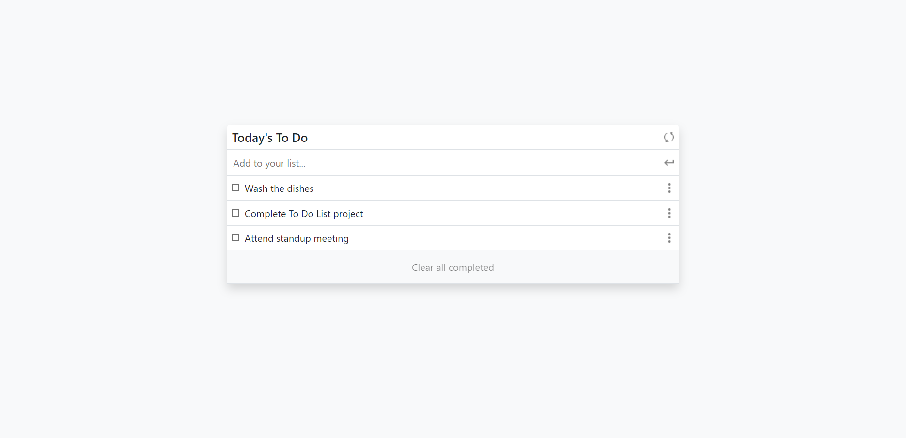

# To-Do List App

To-Do List helps you organize your tasks. It lists the things that you need to do and allows you to mark them as completed. Built using ES6 and Webpack, and it has the following features:

- ➕ Adding a new item.
- ❌ Removing a selected item.
- ✔️ Marking a selected item as complete.
- 🔴 Removing all items marked as complete at once.
- 🚮 Reordering a selected item (as drag-and-drop).

## Screenshots

## Live Version

- [Live version](https://ramoun.me/to-do-list/)

## Built With

- Webpack
- HTML5
- CSS3
- ES6
- Node.js
- Visual Studio Code
- Git & GitHub

## Getting Started

To get Webpack up and running in another project, follow these simple steps:

1. Clone the repository into your machine (Or download .zip file and extract).
2. Open the project's folder.
3. Run npm start.

### Prerequisites

- Any modern web browser.
- Any source-code editor (VSCode recommended).

### Setup

Follow the steps described before.

## Authors

👤 **Ramoun**

 Platform | Badge |
 --- | --- |
 **GitHub**  | 
 **Twitter** | 
 **LinkdIn** | 

## 🤝 Contributing

Contributions, issues, and feature requests are welcome!

Feel free to check the [issues page](../../issues/).

## Show your support

Give a ⭐️ if you like this project!

## Acknowledgments

- Hat tip to anyone whose code was used
- Inspiration
- Microverse program
- My code reviewers

## 📝 License

This project is [MIT](./MIT.md) licensed.
